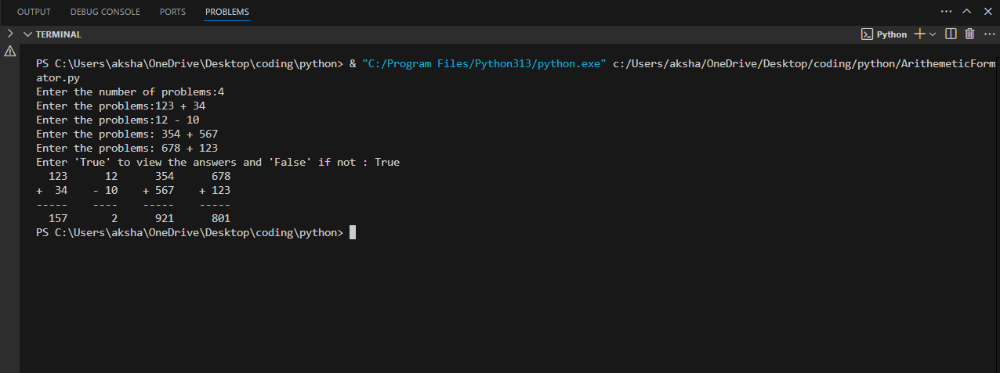

# Arithmetic Formator Using Python

A simple Python program that takes a list of arithmetic problems (addition and subtraction) and returns them formatted vertically and side-by-side just like they are written on paper.

## Features

- Works on five problems at a time.
- Optional flag to show the results.
- Supports addition and subtraction.

## Sample Output



## 🚀 Example Usage

```python
from arithmetic_arranger import arithmetic_arranger

problems = ["123 + 34", "12 + 10", "354 + 567", "678 + 123"]
print(arithmetic_arranger(problems, True))


